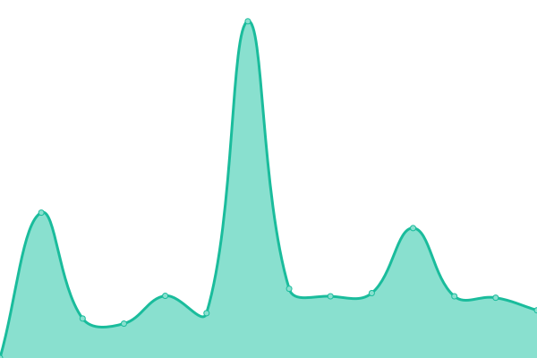
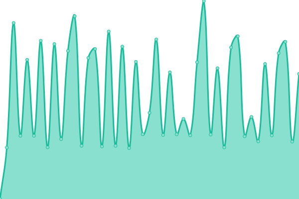
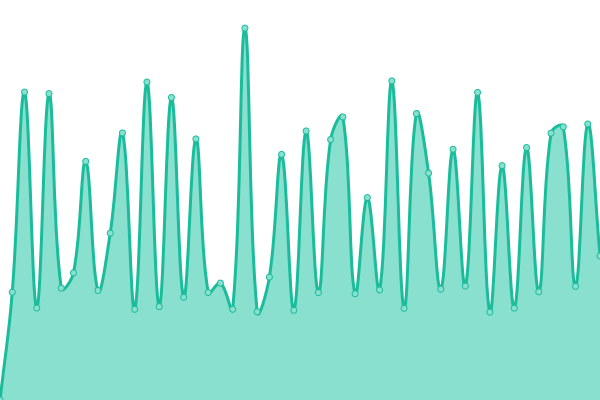

# [📈 Live Status](https://michael-aka-mmh.github.io/whatsupp): <!--live status--> **🟨 Degraded performance**

This repository contains the open-source uptime monitor and status page for [Michael Müller-Hillebrand](https://michael-aka-mmh.github.io/whatsupp), powered by [Upptime](https://github.com/upptime/upptime).

With [Upptime](https://upptime.js.org), you can get your own unlimited and free uptime monitor and status page, powered entirely by a GitHub repository. We use [Issues](https://github.com/michael-aka-mmh/whatsupp/issues) as incident reports, [Actions](https://github.com/michael-aka-mmh/whatsupp/actions) as uptime monitors, and [Pages](https://michael-aka-mmh.github.io/whatsupp) for the status page.

<!--start: status pages-->
<!-- This summary is generated by Upptime (https://github.com/upptime/upptime) -->
<!-- Do not edit this manually, your changes will be overwritten -->
<!-- prettier-ignore -->
| URL | Status | History | Response Time | Uptime |
| --- | ------ | ------- | ------------- | ------ |
|  [DY Website](https://www.docufy.de) | 🟩 Up | [dy-website.yml](https://github.com/michael-aka-mmh/whatsupp/commits/HEAD/history/dy-website.yml) | 

 359ms
     
 | 

<a href="https://michael-aka-mmh.github.io/whatsupp/history/dy-website">99.85%</a>
    

|  [DY Customer area](https://customerarea.docufy.de) | 🟩 Up | [dy-customer-area.yml](https://github.com/michael-aka-mmh/whatsupp/commits/HEAD/history/dy-customer-area.yml) | 

 1396ms
     
 | 

<a href="https://michael-aka-mmh.github.io/whatsupp/history/dy-customer-area">100.00%</a>
    

|  DY VPN | 🟩 Up | [dy-vpn.yml](https://github.com/michael-aka-mmh/whatsupp/commits/HEAD/history/dy-vpn.yml) | 

 0ms
     
 | 

<a href="https://michael-aka-mmh.github.io/whatsupp/history/dy-vpn">100.00%</a>
    

|  DY SMO T | 🟨 Degraded | [dy-smo-t.yml](https://github.com/michael-aka-mmh/whatsupp/commits/HEAD/history/dy-smo-t.yml) | 

 1551ms
     
 | 

<a href="https://michael-aka-mmh.github.io/whatsupp/history/dy-smo-t">0.00%</a>
    

|  DY SMO P | 🟨 Degraded | [dy-smo-p.yml](https://github.com/michael-aka-mmh/whatsupp/commits/HEAD/history/dy-smo-p.yml) | 

 1422ms
     
 | 

<a href="https://michael-aka-mmh.github.io/whatsupp/history/dy-smo-p">0.00%</a>
    

|  [Privat](http://michael.mueller-hillebrand.de) | 🟩 Up | [privat.yml](https://github.com/michael-aka-mmh/whatsupp/commits/HEAD/history/privat.yml) | 

 1419ms
     
 | 

<a href="https://michael-aka-mmh.github.io/whatsupp/history/privat">100.00%</a>
    

|  [Google for reference](https://www.google.com) | 🟩 Up | [google-for-reference.yml](https://github.com/michael-aka-mmh/whatsupp/commits/HEAD/history/google-for-reference.yml) | 

 208ms
     
 | 

<a href="https://michael-aka-mmh.github.io/whatsupp/history/google-for-reference">100.00%</a>
    

<!--end: status pages-->

[**Visit our status website →**](https://michael-aka-mmh.github.io/whatsupp)

## 📄 License

- Powered by: [Upptime](https://github.com/upptime/upptime)
- Code: [MIT](./LICENSE) © [Michael Müller-Hillebrand](https://michael-aka-mmh.github.io/whatsupp)
- Data in the `./history` directory: [Open Database License](https://opendatacommons.org/licenses/odbl/1-0/)
